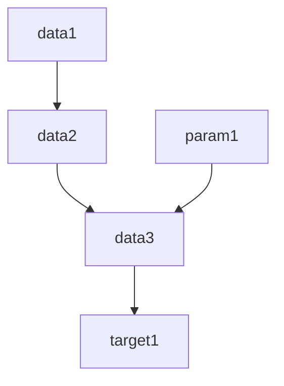
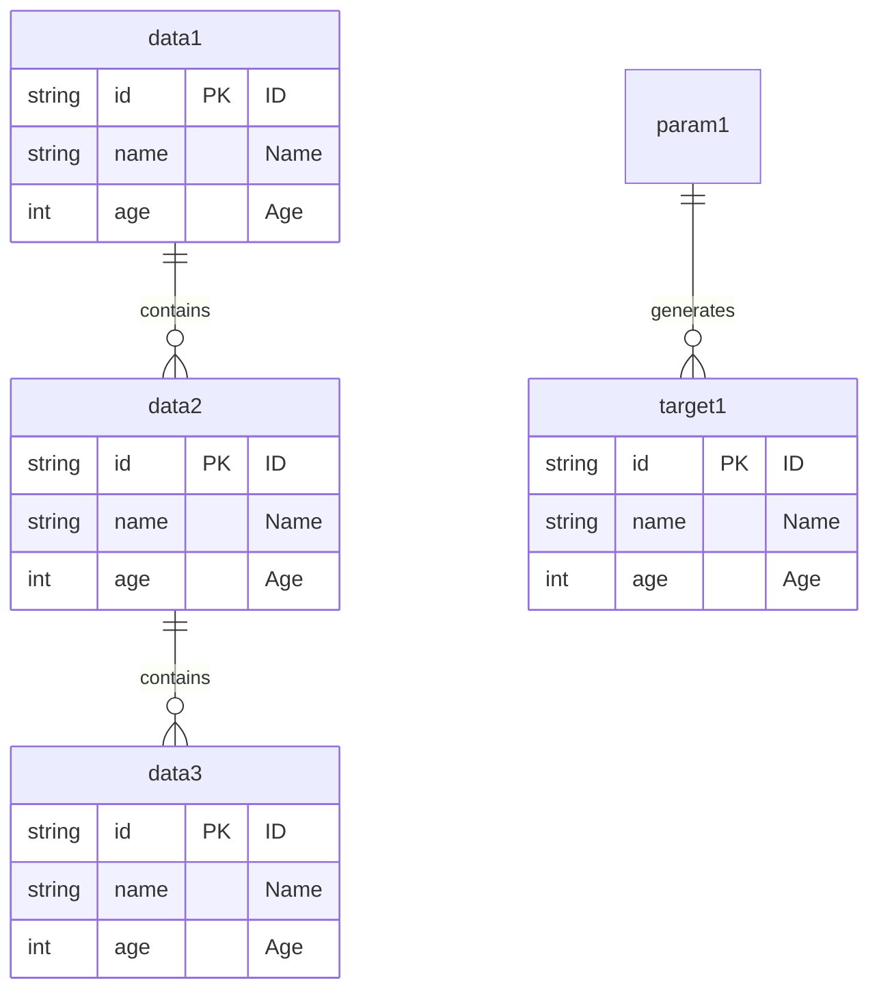

# DATA SPECIFICATION

## 概要

目的は...

### 用語

* A: aa
* B: bb

### Note

* note1

## データ生成プロセス

### target1生成プロセス

## データ仕様

### data1

description: 生データの説明
path: data/raw/data1_{A}.csv
required_data: none
required_param: none

entity:
table: raw_table1
primary_key: id

changelog:

| date       | commit hash | comment          |
| ---------- | ----------- | ---------------- |
| 2023-10-01 | 1234567     | 初版作成         |
| 2023-10-02 | 2345678     | フォーマット変更 |

### data2

### data3

### target1

## パラメータ仕様

### param1

## ER図

