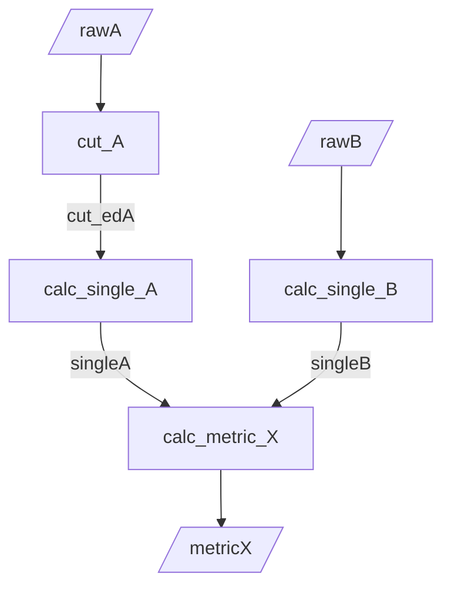
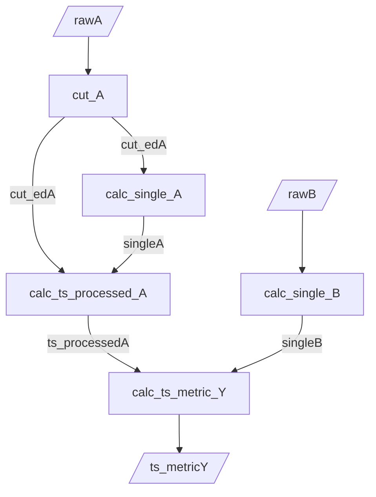

# ドキュメント記述ルール

`info/`以下のドキュメント記述ルール

## 目次

* [ドキュメント記述ルール](#ドキュメント記述ルール)
    * [目次](#目次)
    * [data\_requirements.yml](#data_requirementsyml)
        * [記述ルール](#記述ルール)
            * [目的，備考，特殊なデータ形式の記述](#目的備考特殊なデータ形式の記述)
            * [最終データのプロトタイプ宣言](#最終データのプロトタイプ宣言)
            * [生データの宣言](#生データの宣言)
            * [データ加工の記述](#データ加工の記述)
        * [記述例](#記述例)
            * [出力mermaid](#出力mermaid)
    * [DATA\_FLOW\_DIAGRAMS.md](#data_flow_diagramsmd)

## data_requirements.yml

data_requirements.ymlには，データ解析に必要なデータの要件を記述する．
このファイルにより以下が実現される．

* 研究に必要なデータの形式や項目を明確化
* 中間データの内容や加工手順を整理
* 解析全体のデータフローを把握

YAMLの検証を行うには以下のスクリプトを実行する．

```bash
# YAMLの検証
python scripts/misc/validate_data_requirements.py
```

またこのyamlファイルを自動的にパースし，DATA_FLOW_MERMAID.mdを生成するスクリプトが用意されている．

```bash
# DATA_REQUIREMENTS.mdの生成
python scripts/misc/gen_data_requirements.py
```

### 記述ルール

以下の構成で記述する

1. 目的
1. 備考
1. 最終データのプロトタイプ宣言
1. 生データの宣言
1. データ加工の記述
1. 特殊なデータ形式の記述

各項目の詳細は以下

#### 目的，備考，特殊なデータ形式の記述

* 目的: 解析の目的や意義を記載 (自由記述)
* 備考: 用語定義やその他の補足情報を記載 (自由記述)
* 特殊なデータ形式の記述: 特殊なデータ形式の記述を記載 (自由記述)，markdownのリンクを利用して参照することが望ましい

```yaml
metadata:   # すべて任意
    purpose: <解析やデータ算出の目的，意義>
    note:
        - <用語定義やその他の補足情報1>
        - <用語定義やその他の補足情報2>
        - ...


...

special_data_format:
    <特殊なデータ形式名>:
        description: <特殊なデータ形式の説明>
        format: |
            <特殊なデータ形式の内容, markdown形式で記述>

```

#### 最終データのプロトタイプ宣言

以下の構文で最終データのプロトタイプを宣言する．
最終データは1つ以上定義する必要がある．
<データ名>以下を記述する．
<データ名>は最終データの名前であり，その後に続く要素はそのデータの内容を示す．
<データ名>は重複禁止 (生データのデータ名や加工のステップ名含む)

構文

```yaml
required_data:  # 必須
    <データ名>:  # 必須，重複禁止
        description: <最終データの目的や意味>    # 任意
        input_data: [<算出に必要なデータのデータ名1>, <算出に必要なデータのデータ名2>, ...] # 必須，単一の場合文字列でも可．他の最終データ名を引数とすることも可能
        output_format: <最終データの形式>       # 任意
        unit: <最終データの単位>                # 任意
        formula: <計算式>                      # 任意
```

#### 生データの宣言

以下の構文で生データを宣言する．
生データは1つ以上定義する必要がある．
<データ名>以下を記述する．
<データ名>は生データの名前であり，その後に続く要素はそのデータの内容を示す．
<データ名>は重複禁止 (最終データのデータ名や加工のステップ名含む)

構文

```yaml
raw_data:   # 必須
    <データ名1>:    # 必須
        description: <データの内容>     # 任意
        format: <ファイルタイプや構造>   # 任意
        unit: <データの単位>            # 任意
    <データ名2>:
    ...
```

#### データ加工の記述

以下の構文でデータ加工手順を記述する．
データ加工は最終データ1つに対して1つ定義する必要がある．
<最終データ名>内に解析ステップをリスト形式で記述する．
<最終データ名>は最終データのプロトタイプ宣言で定義した名前と一致させる必要がある．
stepsのnameは重複禁止 (最終データのデータ名や生データのデータ名含む)
既存のステップを再利用する場合は, 省略記法を用いることができる．

構文

```yaml
processing:
    <最終データ名>:
        steps:
            - name: <ステップ名> # 必須
              input_data: [<入力データ名1>, <入力データ名2>, ...] # 必須
              process: # 任意
                - <処理内容1>
                - <処理内容2>
                - ...
              output_data: # 必須
                <出力データ名1>:
                  description: <出力データの説明> # 任意
                  format: <出力データの形式> # 任意
                  unit: <出力データの単位> # 任意
                <出力データ名2>:
                  description: <出力データの説明> # 任意
                  format: <出力データの形式> # 任意
                  unit: <出力データの単位> # 任意
              parameters: # 任意
                <パラメータ名1>:
                  description: <パラメータの説明> # 任意
                  value: <パラメータの値> # 任意
                  unit: <パラメータの単位> # 任意
                <パラメータ名2>:
                  description: <パラメータの説明> # 任意
                  value: <パラメータの値> # 任意
                  unit: <パラメータの単位> # 任意
              notes: # 任意
                - <備考1>
                - <備考2>
                - ...

            - <既存のステップ名> # 省略記法 (すでに定義されているステップを再利用)
            - ...
```

### 記述例

以下の例では, conditionAとconditionBの関係を明らかにするためのデータを整理している．
簡略化のため単位の整合性等は考慮していない．

```yaml
metadata:
    purpose: conditionAとconditionBの関係を明らかにするためのデータを整理
    notes:
        - terms:
            conditionA: 条件A
            conditionB: 条件B

required_data:
    metricX:
        description: conditionAとconditionBの関係を示す指標
        input_data: [singleA, singleB]
        output_format: "{trial_id, metricX}の2列のテーブル"
        unit: "id, 単位なし"
        formula: "metricX = singleA * singleB"
    ts_metricY:
        description: conditionAとconditionBから計算される時系列データ
        input_data: [ts_processedA, singleB]
        output_format: "special_data_format:ts_metricY"
        unit: "sec, 単位なし"
        formula: "ts_metricY(t) = ts_processedA(t) * singleB"

raw_data:
    rawA:
        description: conditionAの生データ
        format: "trial_id毎のcsv, 各ファイルは{time, rawA}の2列"
        unit: "sec, Nm"
    rawB:
        description: conditionBの生データ
        format: "csv, {trial_id, rawB}の2列"
        unit: "id, m"

processing:
    metricX:
        steps:
            - name: cut_A
              input_data: [rawA]
              process:
                - "rawAの最初の10秒をカット"
              output_data:
                cut_edA:
                    description: "カットされたデータ"
                    format: "{time, cut_edA}の2列のテーブル"
                    unit: "sec, Nm"
              parameters: []
            - name: calc_single_A
              input_data: [cut_edA]
              process:
                - "cut_edAの時間平均としてsingleAを計算"
              output_data:
                singleA:
                    description: "時間平均データ"
                    format: "trial_id毎のsingleAのテーブル"
                    unit: "Nm"
              parameters: []
            - name: calc_single_B
              input_data: [rawB]
              process:
                - "rawB * coefficientK + coefficientLとしてsingleBを計算"
              output_data:
                singleB:
                    description: "計算されたデータ"
                    format: "trial_id毎のsingleBのテーブル"
                    unit: "m"
              parameters:
                coefficientK:
                    description: "係数K"
                    value: 1.0
                coefficientL:
                    description: "係数L"
                    value: 3.0
            - name: calc_metric_X
              input_data: [singleA, singleB]
              process:
                - "singleAとsingleBの積としてmetricXを計算"
              output_data:
                metricX:
                    description: "最終データ"
                    format: "定義通り"
                    unit: "Nm*m"
              parameters: []

    ts_metricY:
        steps:
            - cut_A
            - calc_single_A
            - calc_single_B
            - name: calc_ts_processed_A
              input_data: [cut_edA, singleA]
              process:
                - "各時刻においてcut_edAをsingleAで割ってts_processedAを計算"
              output_data:
                ts_processedA:
                    description: "時系列データ"
                    format: "trial_id毎の{time, ts_processedA}のテーブル"
                    unit: "sec, 単位なし"
              parameters: []
            - name: calc_ts_metric_Y
              input_data: [ts_processedA, singleB]
              process:
                - "ts_processedAとsingleBの積としてts_metricYを計算"
              output_data:
                ts_metricY:
                    description: "最終時系列データ"
                    format: "定義通り"
                    unit: "sec, 単位なし"
              parameters: []

special_data_format:
    ts_metricY:
        description: "時系列データ形式"
        format: |
            | time | ts_metricY |
            | ---- | ---------- |
            | 11   | value1     |
            | 12   | value2     |
            | ...  | ...        |

            * time: 時刻 (sec)
            * ts_metricY: metricYの値 (単位なし)
```

#### 出力mermaid

metricX



ts_metricY



## DATA_FLOW_DIAGRAMS.md

data_requirements.ymlを元に生成されるDATA_FLOW_DIAGRAMS.mdには，データの流れを示す図が含まれる．
この図は，データの流れを視覚的に示すことで，データの関係性や加工手順を理解しやすくすることを目的としている．
スクリプトにより自動生成されるため，記述は不要．
