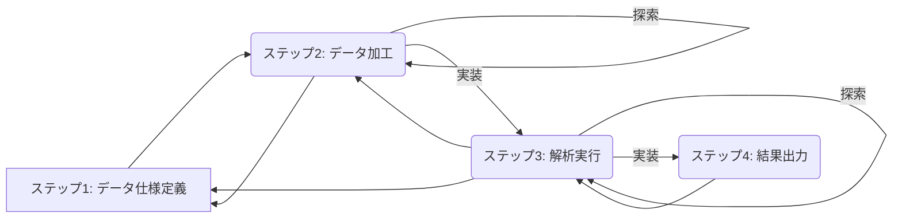

# データ解析ワークフロー

このドキュメントでは, `rtar-core` が提唱する研究データ解析の標準ワークフローを解説する.
このワークフローは, 再現性と追跡可能性を高め, 効率的なデータ解析を支援することを目的とする.

* [データ解析ワークフロー](#データ解析ワークフロー)
    * [用語](#用語)
    * [全体像と反復性](#全体像と反復性)
    * [ステップ1: データ仕様定義](#ステップ1-データ仕様定義)
        * [データ仕様定義の目的](#データ仕様定義の目的)
        * [データ仕様定義のタスク](#データ仕様定義のタスク)
        * [データ仕様定義の成果物](#データ仕様定義の成果物)
    * [ステップ2: データ加工 (Preprocessing)](#ステップ2-データ加工-preprocessing)
        * [データ加工の目的](#データ加工の目的)
        * [探索的データ加工](#探索的データ加工)
        * [データ加工パイプライン実装](#データ加工パイプライン実装)
        * [データ加工の成果物](#データ加工の成果物)
    * [ステップ3: 解析実行 (Analysis)](#ステップ3-解析実行-analysis)
        * [解析の目的](#解析の目的)
        * [探索的解析](#探索的解析)
        * [解析パイプライン実装](#解析パイプライン実装)
        * [解析の成果物](#解析の成果物)
    * [ステップ4: 結果出力 (Reporting)](#ステップ4-結果出力-reporting)
        * [結果出力の目的](#結果出力の目的)
        * [結果出力のタスク](#結果出力のタスク)
        * [結果出力の成果物](#結果出力の成果物)
        * [結果出力のベストプラクティス](#結果出力のベストプラクティス)
    * [再現性確保と追跡](#再現性確保と追跡)
        * [バージョン管理の実践](#バージョン管理の実践)
        * [追跡情報の管理 (`info/`)](#追跡情報の管理-info)

## 用語

* **生データ**, **加工データ**, **解析データ**: これらはワークフローの段階を説明するための概念的な区分. `data_specifications/` 内では, これらは区別なく単一のデータエンティティとして定義される.
    * **生データ**: 計測機器等から直接得られる未加工のデータ.
    * **加工データ**: 生データを解析に適した形式に変換したデータ.
    * **解析データ**: 加工データを用いて統計解析などを行った結果のデータ.
* **データ仕様**: データの依存関係, 物理的構造 (ファイル形式, カラム名など), 論理的構造 (エンティティ間の関連) を定義したもの. `data_specifications/` ディレクトリに格納される.
* **パイプライン**: データ処理や解析のステップを定義し, 自動実行可能にしたもの (例: DVC パイプライン).
* **探索**: データの内容を確認したり, 処理や解析の手法を試行錯誤するプロセス. インタラクティブな環境 (Jupyter Notebook, REPL, MATLAB など) で行われることが多い.
* **実装**: 探索フェーズで確立した手順を, 再利用可能で自動化に適したスクリプトとして記述するプロセス.

## 全体像と反復性

データ解析は主に以下の4つのステップで構成される.

1. データ仕様定義
2. データ加工
3. 解析実行
4. 結果出力

これらのステップは必ずしも線形に進むわけではない. 多くの場合, 解析結果 (ステップ3) を見てデータ加工 (ステップ2) に戻ったり, 新たなデータが必要になりデータ仕様定義 (ステップ1) を修正したりするなど, **反復的なプロセス**となる. このワークフローは, そのような反復を効率的に管理し, 各段階での変更を追跡可能にすることを支援する.

## ステップ1: データ仕様定義

### データ仕様定義の目的

解析の入力となる生データと, 解析プロセスを通じて生成される中間データ, 最終的な成果物に必要なデータの構造と依存関係を明確に定義する. これは後続のステップの基礎となり, プロセスの透明性を確保する上で重要である.

### データ仕様定義のタスク

* **最終的な解析や成果物に必要なデータ項目を洗い出す.** (最初に目標を明確化)
* **利用可能な外部データ (生データ) の特性 (形式, 内容, 取得元など) を把握する.** (次に材料を確認)
* **外部データから要求されるデータへの変換に必要な中間データを特定する.** (最後に中間プロセスを定義)
* 上記に基づき, 以下のデータ仕様ファイルを `data_specifications/` (または設定したディレクトリ) に作成・編集する.
    * `dependencies.yml`: データ間の依存関係を定義.
    * `physical_schema.yaml`: 各データの物理的な構造 (ファイルパス, テーブル構造, カラム型など) を定義.
    * `logical_schema.yaml`: データ間の論理的な関連 (ER図など) を定義.
* データ仕様の作成・検証には `rtar-dspec` などの支援ツールを利用できる.
* **`info/DATA_SPECIFICATION.md` を作成・編集し, 各仕様ファイル (`dependencies.yml`, `physical_schema.yaml`, `logical_schema.yaml`) の定義背景, 設計意図, 関連性, 補足情報などを記録する. これは仕様全体の理解を助けるために重要である.**

### データ仕様定義の成果物

* `data_specifications/dependencies.yml`
* `data_specifications/physical_schema.yaml`
* `data_specifications/logical_schema.yaml`
* **`info/DATA_SPECIFICATION.md`**

## ステップ2: データ加工 (Preprocessing)

### データ加工の目的

生データを, 定義されたデータ仕様に基づき, 解析可能な形式 (加工データ) に変換するプロセスを確立し, 自動化・再現可能にする.

### 探索的データ加工

* **目的**: 生データの内容を確認し, 適切な加工手順を試行錯誤する.
* **タスク**:
    * インタラクティブな環境 (例: Jupyter Notebook `exploratory/preprocessing/`, Python REPL, MATLAB) を使用して, データを読み込み, 内容を確認 (可視化など).
    * 様々な加工処理 (クリーニング, フィルタリング, 特徴量エンジニアリングなど) を試し, その効果を確認する.
    * データ仕様 (`physical_schema.yaml` など) を参照し, 目標とするデータ形式に合致するか検証する.
* **成果物**: 探索に使用したコード (Notebook, スクリプト), 試行錯誤の記録.

### データ加工パイプライン実装

* **目的**: 探索フェーズで確立した加工手順を, 再利用可能で自動実行可能なスクリプトとして実装し, パイプラインを構築する.
* **タスク**:
    * 探索結果に基づき, データ加工を行うスクリプトを `scripts/preprocessing/` (推奨) に作成する. スクリプトはモジュール化され, テスト可能であることが望ましい.
    * スクリプト内で使用する閾値などのパラメータは, `params/preprocessing.yaml` (推奨) のような外部ファイルに分離する.
    * DVC などのパイプラインツールを用いて, スクリプト, パラメータ, 入力データ (`data/raw/`), 出力データ (`data/processed/`) の依存関係を定義する (`dvc.yaml`, `dvc_stages/`).
    * パイプラインを実行 (`dvc repro`) し, 加工データが期待通り生成されることを確認する.
    * パイプライン実行後, `info/PROCESS_OVERVIEW.md` や `info/VERSION_MAPPING.md` などの追跡情報が (半)自動的に更新されることを確認する (または更新ツールを実行).
* **成果物**: 加工スクリプト (`scripts/preprocessing/*.py`), 加工パラメータ (`params/preprocessing.yaml`), DVC パイプライン定義 (`dvc.yaml`, `dvc_stages/`).

### データ加工の成果物

* 加工データ (`data/processed/`)
* 更新された追跡情報 (`info/PROCESS_OVERVIEW.md`, `info/VERSION_MAPPING.md` など)

## ステップ3: 解析実行 (Analysis)

### 解析の目的

加工データを用いて統計解析や機械学習などの手法を適用し, 研究仮説の検証や新たな知見の抽出を行うプロセスを確立し, 自動化・再現可能にする.

### 探索的解析

* **目的**: 加工データの内容を分析し, 適切な解析手法を試行錯誤する.
* **タスク**:
    * インタラクティブな環境 (例: Jupyter Notebook `exploratory/analysis/`, Python REPL, MATLAB) を使用して, 加工データを読み込み, 記述統計量の算出や可視化を行う.
    * 様々な解析手法 (統計検定, モデリングなど) を試し, その結果を評価する.
    * データ仕様 (`logical_schema.yaml` など) を参照し, データの意味解釈を行う.
* **成果物**: 探索に使用したコード (Notebook, スクリプト), 試行錯誤の記録, 中間的な解析結果.

### 解析パイプライン実装

* **目的**: 探索フェーズで確立した解析手法を, 再利用可能で自動実行可能なスクリプトとして実装し, パイプラインを構築する.
* **タスク**:
    * 探索結果に基づき, 解析を行うスクリプトを `scripts/analysis/` (推奨) に作成する.
    * 解析に使用するパラメータ (モデルのハイパーパラメータなど) は, `params/analysis.yaml` (推奨) のような外部ファイルに分離する.
    * DVC などを用いて, スクリプト, パラメータ, 入力データ (`data/processed/`), 出力データ (`data/analysis/`) の依存関係を定義する.
    * パイプラインを実行 (`dvc repro`) し, 解析結果が期待通り生成されることを確認する.
    * パイプライン実行後, 追跡情報 (`info/`) が更新されることを確認する.
* **成果物**: 解析スクリプト (`scripts/analysis/*.py`), 解析パラメータ (`params/analysis.yaml`), DVC パイプライン定義 (`dvc.yaml`, `dvc_stages/`).

### 解析の成果物

* 解析データ (`data/analysis/`)
* 更新された追跡情報 (`info/PROCESS_OVERVIEW.md`, `info/VERSION_MAPPING.md` など)

## ステップ4: 結果出力 (Reporting)

### 結果出力の目的

解析結果 (`data/analysis/`) を解釈し, 論文, 学会発表, レポートなどの特定の目的に合わせて, 図表やサマリーを生成する.

### 結果出力のタスク

* 解析結果データを読み込み, 目的とするメッセージを伝えるための図表を設計する.
* `reports/notebooks/` (インタラクティブな可視化やレポート作成) や `reports/scripts/` (定型的な図表生成) を用いて, 図表やレポートを作成する.
* 必要に応じて, `reports/common/` に共通処理をまとめる.
* 生成した図表を指定された形式 (PNG, PDF, SVGなど) で `reports/figures/` (推奨) に保存する.

### 結果出力の成果物

* レポート用コード (`reports/notebooks/*.ipynb`, `reports/scripts/*.py`)
* 図表ファイル (`reports/figures/*`)

### 結果出力のベストプラクティス

* **スタイルの分離**: 図表の見た目に関する設定 (フォントサイズ, 色, マーカー種類など) は, 解析ロジックから分離することを推奨する. これは, matplotlib のテーマ機能や設定ファイル, または専用のスタイル定義スクリプト (`reports/common/` など) を用いて実現できる. これにより, 論文投稿先や発表媒体に合わせてスタイルのみを容易に変更できる.
* **再利用性**: 特定の図表生成ロジックが複数のレポートで必要になる場合は, `reports/common/` に関数として切り出すことを検討する.

## 再現性確保と追跡

### バージョン管理の実践

* **コード管理**: Git を使用して, 全てのスクリプト (`scripts/`, `reports/`), データ仕様 (`data_specifications/`), パラメータ (`params/`), ドキュメント (`docs/`, `info/`), パイプライン定義 (`dvc.yaml`, `dvc_stages/`) をバージョン管理する.
* **データ管理**: DVC を使用して, 大規模なデータファイル (`data/raw/`, `data/processed/`, `data/analysis/`) のバージョンを管理し, Git リポジトリにはデータファイル自体ではなく `.dvc` ファイル (データへのポインタ) を含める.
* **環境管理**: Docker や Conda などを用いて, 解析に使用したライブラリとそのバージョンを含む実行環境を定義・管理し, 誰でも同じ環境を再現できるようにする. (`env/` ディレクトリ参照).

### 追跡情報の管理 (`info/`)

`info/` ディレクトリは, 解析プロセスの追跡可能性を担保するための情報を格納する場所である. これらのファイルは, 手動で記述する部分もあるが, 多くはパイプラインの実行や専用のユーティリティ (例: `rtar-vmanage` 構想) によって (半)自動的に生成・更新されることを目指す.

* `PROCESS_OVERVIEW.md`: パイプラインツール (例: `dvc dag`) の情報に基づき, データ処理の全体像や各ステップの関係性を示す.
* `VERSION_MAPPING.md`: Git のコミット/タグ, DVC のデータハッシュ, 使用したパラメータなどを紐付け, 特定の結果がどのバージョンのコード, データ, パラメータから生成されたかを記録する.
* `dag_images/`: パイプラインの依存関係グラフ (DAG) の画像を保存する.
* **`DATA_SPECIFICATION.md`**: データ仕様 (`dependencies.yml`, `physical_schema.yaml`, `logical_schema.yaml`) の定義背景, 設計意図, 関連性などを記述する必須ドキュメント.

このワークフローは, 研究の性質やデータに応じて柔軟に調整可能である. 各ステップは独立しており, 必要に応じて反復・修正可能な設計となっている.
